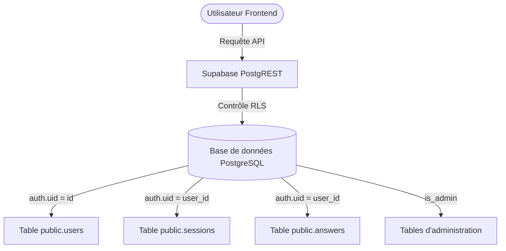

# Rapport d'Audit de Sécurité : Contrôle d'Accès & Validation d'Email

Ce document présente l'audit de sécurité réalisé sur les mécanismes de contrôle d'accès de l'application **ayePREP**, ainsi que le plan d'action de correction mis en œuvre.

---

## 1. Principes Fondamentaux de Sécurité Audités

L'audit s'est concentré sur les exigences critiques d'authentification et d'autorisation :
1. **Validation d'email obligatoire** : Impossibilité pour un nouvel utilisateur d'accéder aux fonctionnalités sans validation préalable.
2. **Contrôle d'accès strict** : Aucun accès aux ressources privées (catalogues, sessions, résultats, profil) pour les utilisateurs non inscrits ou non validés.
3. **Étanchéité des données** : Isolation complète des données utilisateur via les politiques de sécurité de la base de données.

---

## 2. Analyse des Manquements & Corrections Appliquées

### Manquement 1 : Robustesse et Résilience du Callback d'Authentification
- **Constat** : Le callback d'authentification (`AuthCallbackPage.tsx`) supposait que les jetons de connexion (`access_token` / `refresh_token`) étaient transmis uniquement dans les paramètres de requête de l'URL. Or, Supabase redirige souvent en utilisant des fragments de hachage (`#access_token=...`) ou le protocole PKCE (`?code=...`). En cas de redirection standard de confirmation d'email, la page échouait et affichait une erreur, bloquant l'accès.
- **Correction** : Réécriture complète de [AuthCallbackPage.tsx](file:///c:/Users/HP/Documents/GitHub/TEF_TCF_Canada/apps/web/src/pages/auth/AuthCallbackPage.tsx) pour :
  1. Gérer automatiquement l'échange de code d'autorisation PKCE (`supabase.auth.exchangeCodeForSession(code)`).
  2. Extraire et valider les jetons depuis le fragment d'ancre (`window.location.hash`).
  3. Effectuer un contrôle de validation d'email explicite (`email_confirmed_at`) directement lors du traitement du callback.

### Manquement 2 : Absence de Garde-Fou Client en cas de Session Bipassée
- **Constat** : L'état de connexion de l'utilisateur était persisté localement (`fa-auth` dans le localStorage). Un attaquant ou un utilisateur averti pouvait modifier manuellement cette valeur pour simuler une connexion et accéder visuellement aux pages privées.
- **Correction** : Ajout d'une synchronisation automatique et stricte dans [App.tsx](file:///c:/Users/HP/Documents/GitHub/TEF_TCF_Canada/apps/web/src/App.tsx) via `supabase.auth.onAuthStateChange`. Dès le chargement ou la reprise d'activité, la session réelle est validée auprès du serveur Supabase. Si la session est invalide ou si l'e-mail n'est pas confirmé, l'utilisateur est déconnecté instantanément du store frontend et redirigé vers la page de connexion.

### Manquement 3 : Gestion Ergonomique des Erreurs de Validation et Resend
- **Constat** : Si un utilisateur tentait de se connecter avec un email non validé, Supabase renvoyait une erreur brute en anglais (`"Email not confirmed"`). L'application n'offrait aucune traduction, ni aucun moyen pour l'utilisateur de renvoyer le lien d'activation de son compte.
- **Correction** : 
  - Modification de [LoginPage.tsx](file:///c:/Users/HP/Documents/GitHub/TEF_TCF_Canada/apps/web/src/pages/auth/LoginPage.tsx) pour intercepter spécifiquement l'erreur `email_not_confirmed` et afficher un message d'alerte haut de gamme en français.
  - Intégration d'un bouton **"Renvoyer le lien de validation"** déclenchant la fonction `supabase.auth.resend({ type: 'signup' })`.
  - Gestion automatique des limites de requêtes (rate limiting) pour éviter le spamming de mails.

---

## 3. Sécurité de la Base de Données (PostgreSQL / Supabase)

L'audit des politiques RLS (Row Level Security) confirme l'étanchéité des données utilisateur au niveau du serveur :

### Principales politiques RLS en vigueur :
- **Table `public.users`** : 
  - Politique `users_select_own` : Un utilisateur connecté ne peut lire **que** son propre profil (`auth.uid() = id`).
  - Politique `users_update_own` : Un utilisateur ne peut modifier **que** ses propres informations.
- **Table `public.sessions`** & `public.answers` : 
  - Politique `sessions_own` / `answers_own` : Accès restreint au propriétaire de la session (`auth.uid() = user_id`).
- **Table `public.questions`** : 
  - Politique `questions_read_active` : Lecture réservée aux utilisateurs actifs (anonymes ou inscrits) mais sans accès en modification.

> [!WARNING]
> **Important** : Si un utilisateur non inscrit ou non connecté tente d'interroger ces tables via l'API REST publique, les requêtes renvoient systématiquement une réponse vide ou une erreur `401 Unauthorized` car la variable `auth.uid()` est nulle pour les requêtes anonymes non autorisées.

---

## 4. Recommandations de Configuration du Dashboard Supabase

Pour garantir un fonctionnement 100 % étanche en production, vous devez appliquer les configurations suivantes sur le **Dashboard distant de Supabase** :

1. **Activer la confirmation d'email** :
   - Allez dans : `Authentication` ➔ `Providers` ➔ `Email`.
   - Cochez obligatoirement l'option **"Confirm email"**. 
   *(Si cette case est décochée, Supabase valide automatiquement les comptes à l'inscription sans envoyer d'e-mail, ce qui contredit vos exigences de sécurité).*

2. **Configurer l'URL de redirection autorisée** :
   - Allez dans : `Authentication` ➔ `URL Configuration`.
   - Définissez l'URL du site principal (ex: `https://ayeprep.com`) et ajoutez les URL de redirection valides (ex: `https://ayeprep.com/auth/callback` et `http://localhost:5173/auth/callback`).

3. **Paramétrer le Rate Limiting pour la sécurité** :
   - Allez dans : `Authentication` ➔ `Security and Protection`.
   - Ajustez la limite d'envoi d'emails d'authentification (ex : 1 email toutes les 60 secondes par adresse IP) pour prévenir le déni de service et la surfacturation d'emails.
